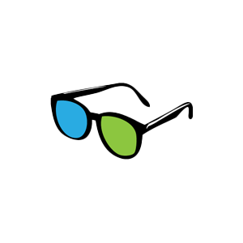

<a href="/">
    
</a>

# GLE Components
A basic React component library.

[](https://www.npmjs.com/package/gle-components)
[](https://www.npmjs.com/package/gle-components)

## Documentation
- [Storybook](https://guyettinger.github.io/gle-components/)

## Installation
```shell
npm install gle-components
```

## Development
Install
```
npm install
```
Build Library
```
npm run build
```
Run Tests
```
npm run test
```
Run Storybook
```
npm run storybook
```